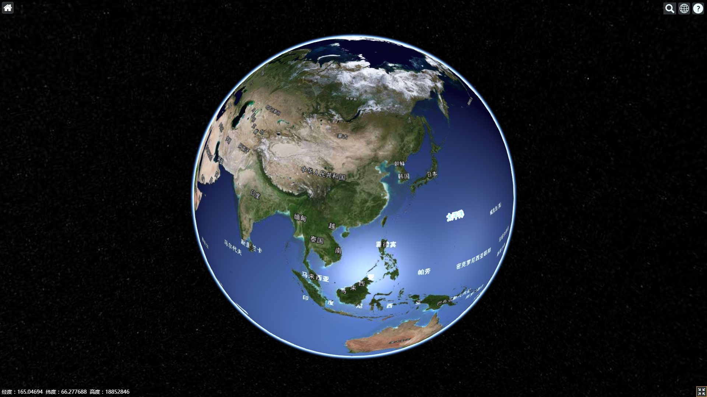

# e-ngx-cesium

e-ngx-cesium is a [cesium](https://cesiumjs.org/) component for Angular.

影像和标注默认使用天地图服务，地形默认使用STK World Terrain



## Usage

1. Install

	```shell
	npm install --save e-ngx-cesium@latest
	```

2. Set in the `.angular-cli.json（@angular/cli）`

	```json
    "assets": [
        {
            "glob": "**/*",
            "input": "../node_modules/cesium/Build/Cesium",
            "output": "./assets/scripts/cesium"
        }
    ],
    "styles": [
        "../node_modules/cesium/Build/Cesium/Widgets/widgets.css"
    ],
    "scripts": [
        "../node_modules/cesium/Build/Cesium/Cesium.js",
        "../node_modules/e-ngx-cesium/dist/viewerCesiumNavigationMixin.js"
    ]
	```

3. Add `cesium-typings` to `typings.d.ts`

	```typescript
    /// <reference path="../node_modules/cesium-typings/index.d.ts" />
	```

4. Set `CESIUM_BASE_URL` in main.ts

	```typescript
    window['CESIUM_BASE_URL'] = '/assets/scripts/cesium'; // 设置cesium请求资源的基本路径
    // window['CESIUM_BASE_URL']需在应用启动之前设置
    platformBrowserDynamic().bootstrapModule(AppModule);
	```

5. Add the `ENgxCesiumModule`

	```typescript
	import { ENgxCesiumModule } from "e-ngx-cesium";
	@NgModule({
	    imports: [
	        ENgxCesiumModule
	    ]
	})
	```

6. Use in Template

	```html
	<e-ngx-cesium [viewerOptions]="viewerOptions" (viewerReady)="onViewerReady($event)"></e-ngx-cesium>
	```

7. Use in Component

	```typescript
    viewerOptions: ViewerOptions;
    viewer: Viewer;

    constructor() {
        this.viewerOptions = {
            scene3DOnly: true,
            selectionIndicator: false,
            baseLayerPicker: false
        };
    }

    onViewerReady(evt: any) {
        this.viewer = evt.viewer;
    }
	```

## API

### Inputs

- `viewerOptions`（`any`） - 创建Cesium.Viewer的属性配置，默认配置：

	```typescript
	private defaultViewerOptions: ViewerOptions = {
        timeline: false,
        animation: false,
        baseLayerPicker: false,
        homeButton: false,
        fullscreenElement: this.globeContainer, // 这里设置viewer所在元素为全屏的元素
        imageryProvider: new Cesium.WebMapTileServiceImageryProvider({
            url: 'http://t0.tianditu.com/img_w/wmts?service=wmts&request=GetTile&version=1.0.0&LAYER=img&tileMatrixSet=w&TileMatrix={TileMatrix}&TileRow={TileRow}&TileCol={TileCol}&style=default&format=tiles',
            layer: 'tdtVecBasicLayer',
            style: 'default',
            format: 'image/jpeg',
            tileMatrixSetID: 'TDTMapsCompatible'
        }),
        terrainProvider: new Cesium.CesiumTerrainProvider({
            url: 'https://assets.agi.com/stk-terrain/world',
            requestWaterMask: true,
            requestVertexNormals: true
        })
    };
	```

- `proxy`（`string`） - 设置代理路径

- `rectangle`（`Cesium.Rectangle`） - 初始范围

### Outputs

- `viewerReady` - Cesium.Viewer创建完成后会触发该事件，参数$event为`{viewer: Cesium.Viewer, scene: Cesium.Scene, globe: Cesium.Globe, ellipsoid: Cesium.Ellipsoid}`

### Instance Method

- 暂无

## Develop

	```shell
	npm install // 安装依赖包
	
	npm start // 启动项目
	```
